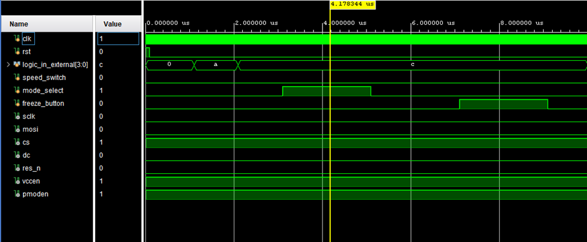

# FPGA_Based_Logic_Analyzer_Display
A miniature logic analyzer display by interfacing Spartan-7 FPGA (XC7S50CSG324-1) and Pmod OLEDrgb OLED (SSD1331)

This project implements a compact 4-channel logic analyzer using a Xilinx Spartan-7 FPGA and a 96x64 RGB OLED (Pmod OLEDrgb - SSD1331).

## 🔧 Features
- 4-bit real-time digital input capture
- OLED waveform visualization
- Test mode with internal signal generator
- External mode for real signals
- Speed control and signal freeze functionality
- Pure Verilog HDL design

## 📁 Project Structure
- `top_logic_analyzer_tb.v` - Testbench for simulation
- `top_logic_analyzer.v` - Module to synthesize all the modules
- `spi_master.v` - Module to define all the SPI protocols for OLED communication
- `ssd1331_init.v` - Module to define instructions for initiation of the OLED display
- `logic_display_pixel_gen.v` - To style and organize the pixels on the OLED
- `Constraints.xdc` - XDC constraint file for pin mapping
- `simulation_image.png` - Screenshot of the simulation waveforms

## 🛠️ Tools Used
- Vivado Design Suite 2020.2+
- Spartan-7 FPGA (XC7S50CSG324-1)
- Pmod OLEDrgb (SSD1331)
- Verilog HDL

## 📸 Demo

## 📄 License
MIT License (or choose another)
